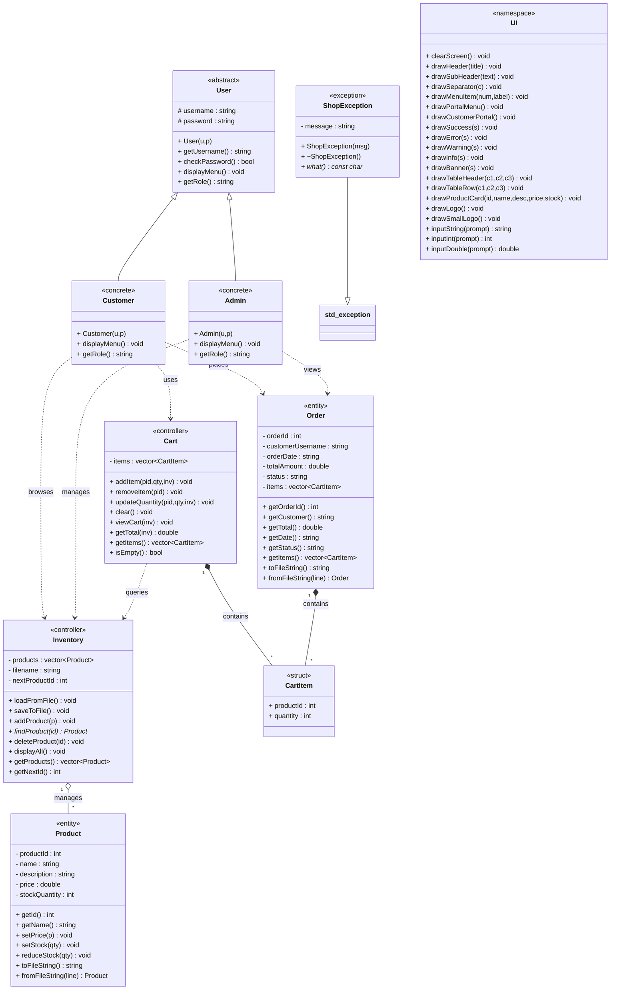

# UML Class Diagram — BDStore-1971

> Visual spec for the C++98 OOP Shopping System.  
> For an interactive handwritten-style version, open [`uml-handwritten.html`](uml-handwritten.html) in a browser.

---

## Visual Overview (Mermaid)

*If the diagram doesn't render above, view the [interactive HTML version](uml-handwritten.html).*

---

## Classes

### 1. User (abstract)
**Stereotype:** abstract class  
**Purpose:** Base class for all system users. Runtime polymorphism entry point.

| Visibility | Member | Type |
|------------|--------|------|
| protected | username | string |
| protected | password | string |
| public | `User(string u, string p)` | constructor |
| public | `~User()` | destructor |
| public | `getUsername()` | string |
| public | `checkPassword(string p)` | bool |
| public | `displayMenu()` | void | *pure virtual* |
| public | `getRole()` | string | *pure virtual* |

### 2. Customer — extends User
**Stereotype:** concrete class  
**Purpose:** Customer portal user. Browse, cart, checkout.

| Visibility | Member | Type |
|------------|--------|------|
| public | `Customer(string u, string p)` | constructor |
| public | `displayMenu()` | void | *override* |
| public | `getRole()` | string | *override* |

### 3. Admin — extends User
**Stereotype:** concrete class  
**Purpose:** Admin portal user. Manage inventory and view orders.

| Visibility | Member | Type |
|------------|--------|------|
| public | `Admin(string u, string p)` | constructor |
| public | `displayMenu()` | void | *override* |
| public | `getRole()` | string | *override* |

### 4. Product
**Stereotype:** entity class  
**Purpose:** Represents a sellable item.

| Visibility | Member | Type |
|------------|--------|------|
| private | productId | int |
| private | name | string |
| private | description | string |
| private | price | double |
| private | stockQuantity | int |
| public | `Product()` | constructor |
| public | `Product(int id, string n, string d, double p, int qty)` | constructor |
| public | `getId()` | int |
| public | `getName()` | string |
| public | `getDescription()` | string |
| public | `getPrice()` | double |
| public | `getStock()` | int |
| public | `setName(string n)` | void |
| public | `setDescription(string d)` | void |
| public | `setPrice(double p)` | void |
| public | `setStock(int qty)` | void |
| public | `reduceStock(int qty)` | void |
| public | `toFileString()` | string |
| public | `fromFileString(string line)` | Product | *static* |

### 5. Inventory
**Stereotype:** controller / manager class  
**Purpose:** Manages the collection of products. Loads/saves from file.

| Visibility | Member | Type |
|------------|--------|------|
| private | products | `vector<Product>` |
| private | filename | string |
| private | nextProductId | int |
| public | `Inventory(string fname)` | constructor |
| public | `loadFromFile()` | void |
| public | `saveToFile()` | void |
| public | `addProduct(Product p)` | void |
| public | `updateProduct(int id, Product p)` | void |
| public | `deleteProduct(int id)` | void |
| public | `findProduct(int id)` | Product* |
| public | `displayAll()` | void |
| public | `displayAvailable()` | void |
| public | `getProducts()` | `vector<Product>` |
| public | `getNextId()` | int |

### 6. CartItem
**Stereotype:** data struct  
**Purpose:** Lightweight item inside a cart or order.

| Visibility | Member | Type |
|------------|--------|------|
| public | productId | int |
| public | quantity | int |

### 7. Cart
**Stereotype:** controller class  
**Purpose:** Holds customer-selected items before checkout.

| Visibility | Member | Type |
|------------|--------|------|
| private | items | `vector<CartItem>` |
| public | `addItem(int pid, int qty, Inventory& inv)` | void |
| public | `removeItem(int pid)` | void |
| public | `updateQuantity(int pid, int qty, Inventory& inv)` | void |
| public | `clear()` | void |
| public | `viewCart(Inventory& inv)` | void |
| public | `getTotal(Inventory& inv)` | double |
| public | `getItems()` | `vector<CartItem>` |
| public | `isEmpty()` | bool |

### 8. Order
**Stereotype:** entity class  
**Purpose:** Finalized purchase record.

| Visibility | Member | Type |
|------------|--------|------|
| private | orderId | int |
| private | customerUsername | string |
| private | orderDate | string |
| private | totalAmount | double |
| private | status | string |
| private | items | `vector<CartItem>` |
| public | `Order()` | constructor |
| public | `Order(int oid, string user, string date, double total, string stat, vector<CartItem> its)` | constructor |
| public | `getOrderId()` | int |
| public | `getCustomer()` | string |
| public | `getTotal()` | double |
| public | `getDate()` | string |
| public | `getStatus()` | string |
| public | `getItems()` | `vector<CartItem>` |
| public | `toFileString()` | string |
| public | `fromFileString(string line)` | Order | *static* |

### 9. ShopException — extends `std::exception`
**Stereotype:** exception class  
**Purpose:** Domain-specific error handling.

| Visibility | Member | Type |
|------------|--------|------|
| private | message | string |
| public | `ShopException(string msg)` | constructor |
| public | `~ShopException()` | destructor |
| public | `what()` | const char* |

### 10. UI (namespace)
**Stereotype:** utility namespace  
**Purpose:** Terminal styling, input helpers, screen management. All methods static.

| Visibility | Member | Type |
|------------|--------|------|
| public | `clearScreen()` | void$ |
| public | `drawHeader(string title)` | void$ |
| public | `drawSubHeader(string text)` | void$ |
| public | `drawSeparator(char c)` | void$ |
| public | `drawMenuItem(int num, string label)` | void$ |
| public | `drawPortalMenu()` | void$ |
| public | `drawCustomerPortal()` | void$ |
| public | `drawSuccess(string)` | void$ |
| public | `drawError(string)` | void$ |
| public | `drawWarning(string)` | void$ |
| public | `drawInfo(string)` | void$ |
| public | `drawBanner(string)` | void$ |
| public | `drawTableHeader(string c1, string c2, string c3)` | void$ |
| public | `drawTableRow(string c1, string c2, string c3)` | void$ |
| public | `drawProductCard(int id, string name, string desc, double price, int stock)` | void$ |
| public | `drawLogo()` | void$ |
| public | `drawSmallLogo()` | void$ |
| public | `inputString(string prompt)` | string$ |
| public | `inputInt(string prompt)` | int$ |
| public | `inputDouble(string prompt)` | double$ |

*Note: `$` = static method*

---

## Relationships

| Type | From | To | Label | Description |
|------|------|----|-------|-------------|
| Inheritance | Customer | User | extends | Customer is a User |
| Inheritance | Admin | User | extends | Admin is a User |
| Inheritance | ShopException | `std::exception` | extends | Custom error type |
| Composition | Cart | CartItem | contains | Cart owns items; destroyed together |
| Composition | Order | CartItem | contains | Order owns items; destroyed together |
| Aggregation | Inventory | Product | manages | Products exist independently via file I/O |
| Dependency | Customer | Cart | uses | Customer adds / removes items |
| Dependency | Customer | Inventory | browses | Customer views available products |
| Dependency | Customer | Order | places | Customer creates orders at checkout |
| Dependency | Admin | Inventory | manages | Admin adds/updates/deletes products |
| Dependency | Admin | Order | views | Admin sees all customer orders |
| Dependency | Cart | Inventory | queries | Cart checks stock before adding items |

---

## Diagram Layout Notes

- **User hierarchy** is placed top-center (`User` above `Customer` / `Admin`).  
- **Product–Inventory** sits on the left. Inventory manages Product via aggregation (hollow diamond).  
- **Cart–CartItem** sits center-right. Solid diamond (composition) from Cart to CartItem.  
- **Order** is far right. Composition to CartItem. Order also links to Customer via username string (dashed dependency).  
- **ShopException** is top-right. Inheritance arrow to `std::exception`.  
- **UI namespace** is bottom-left, grouped as a large utility block.  
- **Dependencies** from Customer / Admin to their interaction targets are rendered as dashed arrows.  
- **Color convention** (HTML version): private = red, protected = amber, public = green, static = purple.
