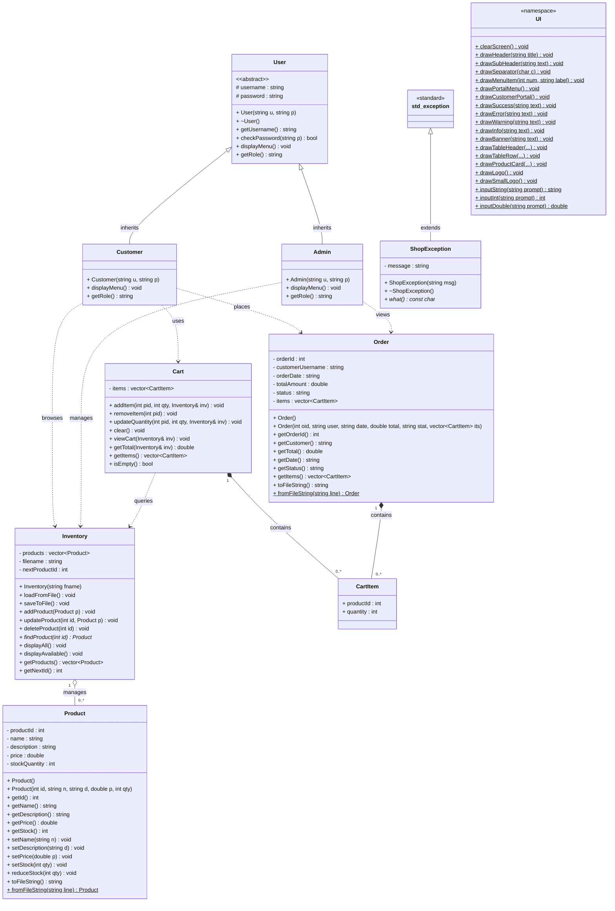

<h1>BDStore-1971 — UML Class Diagram</h1>

Object-Oriented Design Overview

---

## Class Diagram

---

## Relationship Summary

| Type | From | To | Meaning |
|------|------|-----|---------|
| Inheritance | `Customer` | `User` | Customer is a User |
| Inheritance | `Admin` | `User` | Admin is a User |
| Inheritance | `ShopException` | `std::exception` | Custom domain exception |
| Composition | `Cart` | `CartItem` | Cart owns its items |
| Composition | `Order` | `CartItem` | Order owns its items |
| Aggregation | `Inventory` | `Product` | Inventory manages Products |
| Dependency | `Customer` | `Cart`, `Inventory`, `Order` | Customer uses these |
| Dependency | `Admin` | `Inventory`, `Order` | Admin uses these |
| Dependency | `Cart` | `Inventory` | Cart queries stock |

---

## Design Notes

- **Runtime Polymorphism** is demonstrated via the `User*` pointer in `main.cpp`: it holds either a `Customer` or `Admin` object, and calling `displayMenu()` or `getRole()` dispatches to the correct derived class at runtime.
- **Abstraction** is enforced by making `User` abstract (pure virtual methods), preventing direct instantiation.
- **Composition** is used for `Cart`→`CartItem` and `Order`→`CartItem`, meaning items are owned and destroyed with their container.
- **Aggregation** is used for `Inventory`→`Product`, as Products can exist independently (e.g., loaded from/saved to file).
- **Encapsulation** keeps all data members private; controlled access through public getters/setters.
